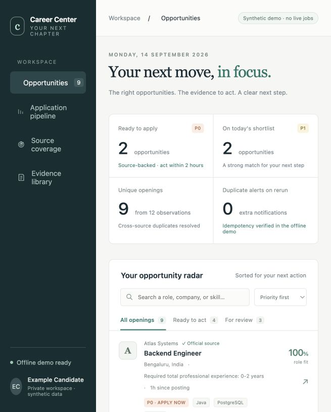
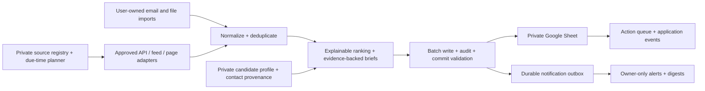

# Career Command Center

Find relevant engineering openings, understand the evidence behind each ranking, and prepare a truthful application from one private Google Sheet. Career Command Center combines permitted job discovery, deduplication, deterministic fit scoring, application tracking, contact provenance, and owner-only email notifications. It requires no paid API, model, hosted database, or continuously running server.



The screenshot is a **synthetic, local demo**. The interactive preview includes search, priority filters, job details, application workflow, evidence, and source coverage. Production records live in your private Sheet; the demo never reads your resume or credentials.

## Try it locally

Install Python 3.12+ and [uv](https://docs.astral.sh/uv/getting-started/installation/), then run from the checkout:

```sh
uv sync --locked
uv run career-radar doctor
uv run career-radar bootstrap-sheet --offline
uv run career-radar scan --dry-run --offline-fixtures
uv run career-radar digest --period morning --no-send
uv run career-radar demo
uv run career-radar source check --all
```

Open `.demo/dashboard.html` and `.demo/email-preview.html` in your browser. `demo` runs the same pipeline twice against a disposable in-memory workbook and exports only synthetic previews. The fixed oracle is:

| Measurement | First run | Same input again |
|---|---:|---:|
| Observations / canonical jobs | 12 / 9 | 12 / 9 |
| P0 / P1 / P2 / P3 / excluded | 2 / 2 / 3 / 1 / 1 | unchanged |
| New jobs | 9 | 0 |
| New drafts | 4 | 0 |
| New alert decisions | 2 | 0 |
| Email sends | 0 | 0 |

Installation needs normal package-index access. After installation, the offline demonstration needs neither networking nor credentials. `doctor` reports readiness separately for offline use, Sheet access, email sending, mailbox ingestion, and scheduling. An offline-ready result does not mean a live integration has been verified.

## How it works



The typed Python modular monolith has one idempotent pipeline for fixtures, imports, and scheduled collection. Google Sheets is the production authority. An explicit fake workbook supports offline testing; no hidden local database becomes a second production truth.

Discovery owns factual fields. People own application status, priorities, contact permission, and notes. Source-specific observations preserve provenance; incomplete or failed scans cannot close jobs. Immutable application events, material-change history, quarantine records, and outbox states explain what happened. A send with an uncertain response becomes `AMBIGUOUS` and is never automatically retried.

## Source support and honest coverage

| Source class | This release |
|---|---|
| Greenhouse, Lever, Ashby public interfaces | Implemented, with synthetic parser and transport contracts |
| RSS / Atom, sitemap → JobPosting JSON-LD, direct JSON-LD | Implemented; each source requires current human policy approval |
| User-owned CSV / TSV / JSON jobs and HTML `.eml` alerts | Implemented local imports |
| LinkedIn / Google Contacts exports | Implemented; private, provenance-aware imports |
| Live Gmail / IMAP ingestion | Deferred; local `.eml` import available |
| Workable, SmartRecruiters, Hacker News | Deferred; no support claimed |
| Restricted-platform scraping or headless collection | Disabled |

The neutral catalogue contains **280 companies, zero approved live automated sources, 277 pending rows, and three manual/native-alert routes**. A listed company is a research starting point, not verified collection coverage. Current policy review, an observed official endpoint, schema validation, and a named reviewer are required before a source can run. See the complete [support matrix and policy](docs/sources.md) and [source onboarding guide](docs/adding-a-source.md).

LinkedIn and similar services use user-created native alerts, exports, and manual links. There is no automated login, private API discovery, CAPTCHA handling, proxy rotation, contact enrichment, third-party messaging, or application submission. Job descriptions and imported cells are untrusted data, never program instructions. Every draft uses approved evidence; outreach remains a manual decision.

## Activate your private workspace

Follow [SETUP_REQUIRED.md](SETUP_REQUIRED.md) and the [setup guide](docs/setup.md). Copy `.env.example` to a private `.env`, configure a private candidate profile, a high-entropy HMAC key, one alert recipient, and Google credentials. Create an invite-only Sheet and grant only the intended service account access.

```sh
uv run python scripts/setup_google.py --plan
uv run python scripts/setup_gmail.py --plan --purpose send
uv run career-radar bootstrap-sheet
uv run career-radar doctor --require sheet --verify-write
uv run career-radar sheets verify
uv run career-radar scan --mode full --dry-run
```

For a user-owned contacts export:

```sh
uv run career-radar import contacts /absolute/path/Connections.csv --format linkedin-connections
```

Without a configured Sheet, imports stage in `.private/` with restrictive permissions and report `STAGED_PRIVATE`; they do not pretend to be imported into production. The bootstrap profile is used only for initial seeding. Later edits belong in the private Sheet. See the [Sheet guide](docs/sheet-guide.md), [data dictionary](docs/data-dictionary.md), [scoring rules](docs/scoring.md), and [outreach rules](docs/outreach-safety.md).

## Scheduling and cost

The public repository has ordinary CI and a reusable runtime workflow, with no public recurring collection. The [private runtime template](runtime-template/README.md) pins both workflow and implementation to the same reviewed commit. Tracker and scheduler are disabled by default.

| Run | Asia/Kolkata schedule |
|---|---|
| Weekday incremental | 06:47, 09:47, 12:47, 15:47, 18:47, 21:47 |
| Weekend incremental | 09:47, 15:47, 21:47 |
| Full reconciliation | Daily 02:23 |
| Owner digests | Daily 08:11 and 19:11 |
| Maintenance | Sunday 03:43 |

Hard inner budgets, HTTP/Sheet request limits, serialized runs, source cadence, email caps, and an account-wide allowance check bound work. The worst calendar month reserves **1,176 scheduled private Actions minutes**, or **1,376 including retry/manual headroom**, before the separate account reserve. Paid overage must be disabled and the allowance attestation current. A local scheduler is an alternative. Vendor allowances can change; cron timing is best effort. See [operations](docs/operations.md), [cost controls](docs/cost-controls.md), and [official references checked on 2026-09-14](docs/references.md).

## Verification and contribution

```sh
uv run ruff check .
uv run ruff format --check .
uv run mypy --strict src/career_radar
uv run pytest --cov=career_radar --cov-branch --cov-report=json
uv run python scripts/check_core_coverage.py
uv run bandit -q -r src/career_radar
uv run pip-audit
uv run python scripts/verify_public_repo.py
uv run python scripts/estimate_actions_budget.py
uv run python scripts/verify_offline.py
uv run python -m build
```

The boundary check inspects Git's index, so it must run after staging only public deliverables. CI also runs a pinned Gitleaks action. Tests cover duplicate/reordered inputs, partial failures, source policy changes, recipient isolation, ambiguous sends, formula injection, XXE, SSRF, contact suppression, and application-state preservation. See [verification evidence](docs/verification.md), [CONTRIBUTING.md](CONTRIBUTING.md), and [SECURITY.md](SECURITY.md).

Known limits: live credentials and source approvals require owner setup; no production Sheet, send, or scheduled run is claimed by the offline demo. Google Sheets does not provide database transactions, so single-writer execution, commit validation, and recovery records are required. Role/skill taxonomies are code defaults in this release; scoring weights are configurable in the Sheet. The HTML dashboard is a synthetic product preview, while the Sheet is the operational UI. Mail template changes can require manual import. Deferred connectors are not included in live coverage.

MIT licensed.
