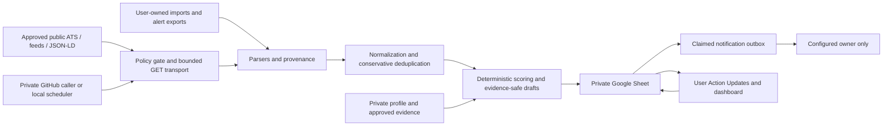

# Architecture and trust boundaries

A Python CLI drives one deterministic pipeline. The authoritative private Google Sheet holds jobs, evidence, contacts, workflow state, source policy, run history and notification decisions. There is no hosted database or runtime AI model. A fake workbook makes the same decisions testable offline; its `.demo` files are disposable representations rather than production state.

The source registry separates mechanism, policy permission, coverage validation and operational health. New sources fail closed. Collection checks current named-human policy evidence, cost classification, allowed hosts, SSRF boundaries and backoff before each network hop. Validation probes are a separate user-initiated, no-extraction path. Parsers only transform bytes into typed observations; they cannot approve sources or trigger network access.

Every observation retains source identity, URL/message token, fetch time, parser version and raw date evidence. Normalization preserves date uncertainty and distinguishes source publication from first-seen proxies. Deduplication uses provider/tenant/job ID, canonical links and conservative corroboration. Similar titles are insufficient to prove two openings are identical. Lifecycle closure depends on successful complete source snapshots; failures, partial runs and anomalies cannot imply mass closure.

Scoring separates resume fit, evidence, experience gap, location, freshness and action eligibility. Candidate evidence comes from the private approved profile. Strategy/outreach generation cannot strengthen claims beyond approved atomic statements. Contacts retain field-level provenance and privacy permissions. Outreach remains a draft for the user, while notification transport is restricted to the configured owner.

Sheet operations use bounded batches and explicit run finalization. A single Google batch request can be atomic; multiple requests are not one transaction. Chunk/run IDs and deterministic keys support replay after interruption. User-owned workflow columns are protected by ownership rules and Action_Updates validation. The notification outbox claims deterministic IDs before transport and preserves ambiguous outcomes instead of retrying blindly.

The sole production writer is selected through one scheduler configuration: the private GitHub caller's serialized queue or a local advisory-lock dispatcher. A Sheet lease/heartbeat is a contention and staleness signal, not a distributed compare-and-swap lock. The public reusable workflow contains no cron and checks out the exact reviewed implementation SHA; private schedules and named secrets stay in the runtime repository.

Current limitations include zero preapproved automated company sources, generic local email-template parsing, deferred live Gmail/IMAP message ingestion, and unverified live credentials until the user completes setup. The application has OAuth token/identity validation and owner-only send transport; read-token verification is distinct from a working mailbox collector. See the source matrix and setup guide before claiming live coverage.
